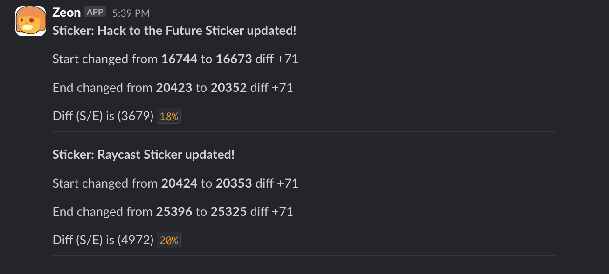

[](https://wakatime.com/badge/user/018eed1d-6093-4f51-9fca-7863b7a1ac97/project/62244372-2f3d-4194-a3eb-bad8c471cf66)
## Hackclub Stickers Watcher


This is a slack bot which watches the arcade stickers and posts a message when a new sticker is added or when the stickers are updated.
The schema for the API is as follows:
```sql
id INTEGER PRIMARY KEY,
name TEXT,
sku TEXT,
image_url TEXT,
stock INTEGER, 
start INTEGER,
end INTEGER
```

## Setup

To setup this app you must have nodejs (20.x) and npm installed.

```bash
npm install
```
Make sure to populate the env correctly as well.

